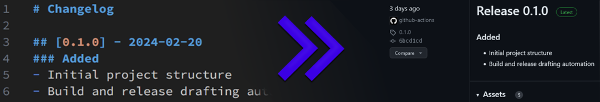

# Go-Release-Builder



[Go](https://go.dev/) project template for automatically creating releases with [GitHub Actions](https://docs.github.com/en/actions) by simply updating a changelog, targeting Linux and [WSL](https://learn.microsoft.com/en-us/windows/wsl/install) environments.

## Overview

This Go project template streamlines the development and distribution process for applications targeting Linux and the Windows Subsystem for Linux (WSL). It offers two main features:

- **Automatic Release Drafting**: Automate your release process with GitHub Actions. Simply update the `docs/CHANGELOG.md` with a new entry and push to the main branch. When the workflow sees the new version it will build and create a release draft, ready for you to publish after reviewing it.

- **Version Injection**: During the automatic build, it will inject the version from the changelog into the go build command. The result is the ability for things like version commands. `example_app -version` Will always print the correct version without you ever having to touch it :3

- **Transparent WSL Operation**: Seamlessly execute your Go applications within WSL from the Windows command line, no need to preface commands with wsl. For more information, see the FAQ section below.

## Target Audience
- Developers releasing projects on Linux and WSL transparently (see FAQ).
- End users familiar with basic CLI operations.
- Projects seeking a lightweight distribution method.

## Quick Start:

### For Developers

**Prerequisites**:
- [Go](https://go.dev/): Must be installed within the Windows Subsystem for Linux (WSL). Installing on Windows as well is optional but not required.
- Ensure your GitHub repo has Workflow permissions set to read and write.

**Steps**:

1. Create a new repo from this template.
2. Configure your application's name:
    - Open `scripts/build.sh` in a text editor and set 'APP_NAME' to the name of your application. This will be the command to run your application.
    - Rename the `/cmd/example_app/` directory to your application's name, ensuring it matches the 'APP_NAME' in the build script.
    - Finally replace 'example_app' the the `go.mod` file.
3. Develop your amazing Go application.
4. For releases:
    - Log a new entry in `docs/CHANGELOG.md`. See FAQ for the format.
    - Push to the main branch.
    - GitHub Actions will draft a release, which you can then publish.

### For End Users:

**Windows Installation**:
1. Install WSL with a Debian-based distro.
2. Download and extract the release.
3. Run the following in a terminal with admin rights:
    ```powershell
    Set-ExecutionPolicy Bypass
    .\install-win.ps1
    ```

**Linux Installation**:
1. Download and extract the release.
2. Run in a terminal:
    ```shell
    sudo ./install-linux.bash
    ```

**Updating**: Download the new version and repeat the installation steps.

### FAQ

<details>
<summary><b>Changelog Format</b></summary>

The release process hinges on the updates you make to the `docs/CHANGELOG.md`. Here’s a quick guide:

1. **Adding a Release Entry**:
    - When you're ready for a new release, add an entry to `docs/CHANGELOG.md` in this format:

```md
## [Version] - YYYY-MM-DD
Everything between version lines is considered the description.
```

2. **Triggering the Release**:
    - A push to the main branch with a new entry in `docs/CHANGELOG.md` triggers our GitHub Actions. It looks for the latest version entry. If it's new, it initiates the release process.

3. **Draft Release Creation**:
    - The action creates a draft release using the version and description from your entry. This draft is not public until you review and publish it.

4. **Tag Application**:
    - Publishing the draft automatically creates and applies a tag with the version to your repository. This finalizes the release.

Remember, the release automation relies on the exact format of the `docs/CHANGELOG.md` entry. Ensure your version and date are correctly formatted to smoothly run the process.

</details>

<details>
<summary><b>What is "transparent WSL operation"</b></summary>

This template enables execution of your Go application within WSL without needing to prefix the command with `wsl`. A ps1 script under the same name as your app is placed in the Windows system path, it runs your app using WSL in the the cwd, passing along any args given, allowing users to run the application as if it were a native Windows command.

For example, instead of using:
```powershell
wsl example_app --arg
```
Users can simply type:
```powershell
example_app --arg
```

This allows for the magical experience of Linux-only CLI tools within the Windows environment.
</details>

<details>
  <summary><b>Including Loose Files in Releases</b></summary>
  
  The current workflow and install scripts are designed to handle a single binary file. It's possible to modify them to include additional files or directories with minimal effort, but I don't recommended it. Instead, consider utilizing the amazing [`go:embed`](https://pkg.go.dev/embed) package from the Go standard library.
</details>

<details>
<summary><b>Issues with Creating Release on Main Push</b></summary>

Problem: The GitHub Action fails when pushing to main, with an error about creating the release.

Solution: Check your repository settings. Go to Settings -> Actions -> General -> Workflow permissions and ensure it's set to 'Read and write permissions'.
</details>

#

For an insightful overview of recommended project file structures, consider exploring [this guide](https://github.com/golang-standards/project-layout). Wishing you the best in your development journey! ❤️

<!-- Remember your code is more than just syntax; it's a testament to your journey. Whether it's your first line or your millionth, know that your dedication shapes the future. I'm proud of you, never give up on your dreams. Keep pushing, keep creating, and always, always keep believing in yourself. -->